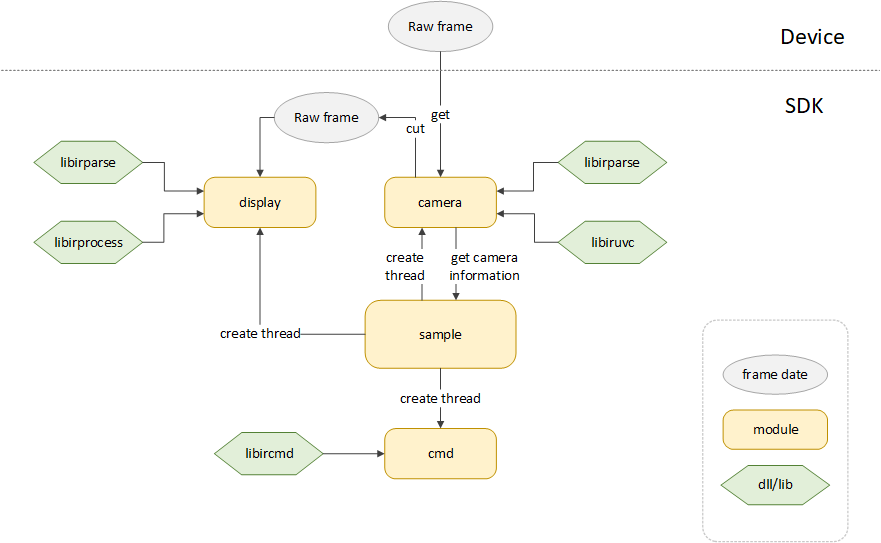

# libirsample program structure and user's manual


## 1. Program structure



As shown, the sample includes these modules: sample, camera, display, cmd. The function of each module as follows:

**sample module**: After configuring the relevant parameters in sample.cpp, call the camera module to establish a connection with the infrared camera, and stream the image. Later sample module will create 4 threads: stream, display,  temperature, and cmd, to process the corresponding information.

**camera module**: Used to obtain the information of infrared cameras. When stream thread obtains the original infrared frames, the raw frames will be divided into the image information(image frame) and temperature information(temp frame).At the same time, the signals will be transmitted to the corresponding modules. When image frame processing is compete, the signals will be transmitted back to camera thread, to continue the next loop.

**display module**: After obtaining the image frame information, according to the configuration of the parameters in frame_info, the image will be processed by data format conversion, flipping, mirroring, rotation and so on. In the end, it calls opencv to display the processed image.

**cmd module**: Sending the corresponding command to the infrared camera.


## 2. Program compilation method

On windows, a complete VS project is provided in the libir_sample folder, the opencv library and pthreadVC2.dll are required to run the example (already placed).

On linux, there are `Makefile` and `CMakeLists.txt` files in libir_sample, you need to remove the opencv2 folder at compile time (Linux needs to install it separately). If you don't need opencv, you can comment `#define OPENCV_ENABLE` in the display.h file, and comment opencv related content in the `Makefile` or `CMakeLists.txt` before compiling.


## 3. User's manual

### 3.1 Camera connection

In the main function of sample.cpp, the corresponding camera is selected by calling ir_camera_oepn, and get the relevant parameters information(stream_frame_info) from the camera.

After obtaining the parameter information, it is required to call load_stream_frame_info function to supplement  the settings for display and temperature modules, such as: width and height information, rotation/mirror/flip settings, pseudo color included in the library enable switch, input and output frame format, apply for buffer space, and so on.

```c
        stream_frame_info->image_info.width = stream_frame_info->camera_param.width;
        stream_frame_info->image_info.height = stream_frame_info->camera_param.height / 2;
        stream_frame_info->image_info.rotate_side = LEFT_90D;
        stream_frame_info->image_info.mirror_flip_status = STATUS_MIRROR_FLIP;
        stream_frame_info->image_info.pseudo_color_status = PSUEDO_COLOR_ON;
		stream_frame_info->image_info.img_enhance_status = IMG_ENHANCE_OFF;
        stream_frame_info->image_info.input_format = INPUT_FMT_YUV422; 	//only Y14 or Y16 mode can use enhance and pseudo color
        stream_frame_info->image_info.output_format = OUTPUT_FMT_BGR888; //if display on opencv,please select BGR888

        stream_frame_info->temp_info.width = stream_frame_info->camera_param.width;
        stream_frame_info->temp_info.height = stream_frame_info->camera_param.height / 2;
        stream_frame_info->temp_info.rotate_side = NO_ROTATE;
        stream_frame_info->temp_info.mirror_flip_status = STATUS_NO_MIRROR_FLIP;
        stream_frame_info->image_byte_size = stream_frame_info->image_info.width * stream_frame_info->image_info.height * 2;
        stream_frame_info->temp_byte_size = 0;//no temp frame input
```

The following is the definition of the StreamFrameInfo_t structure. Note these parameters:

FrameInfo_t-width/height: width and height parameters, need to be filled in.

FrameInfo_t-byte_size: byte size of current frame_info, the display_image_process function in display.cpp will be filled in automatic according to the data format while streaming. 

FrameInfo_t-rotate_side/mirror_flip_status: flip/mirror/rotate and so on status, need to be filled in.

FrameInfo_t-input_format/output_format: the data format of input and output frame, such as Y14 data input, RGB888 output, and so on, need to be filled in.

FrameInfo_t-pseudo_color_status: the switch of pseudo color. The pseudo color mapping table in the libirprocess library will be called, if the switch is turned on. Need to be filled in.

FrameInfot-imgenhance_status:If the switch of image stretch. The image stretching algorithm in libirprocess library will be called to stretch Y14 / Y16 data, Need to be filled in.

StreamFrameInfo_t-image_byte_size/temp_byte_size: the byte size of the input frame. If it is filled in 0, then no data can be received. Fill it in according to the size of the data that needs to be split.

```c
typedef struct {
    uint32_t width;
    uint32_t height;
    uint32_t byte_size;
    RotateSide_t rotate_side;
    MirrorFlipStatus_t mirror_flip_status;
    InputFormat_t  input_format;
    OutputFormat_t  output_format;
    PsuedoColor_t  pseudo_color_status;
    ImgEnhance_t   img_enhance_status;
}FrameInfo_t;

typedef struct {
    IruvcHandle_t* iruvc_handle;
    IrcmdHandle_t* ircmd_handle;
    UserCallback_t callback;
    uint8_t* raw_frame;
    uint8_t* image_frame;
    uint32_t image_byte_size;
    uint8_t* temp_frame;
    uint32_t temp_byte_size;
    FrameInfo_t image_info;
    FrameInfo_t temp_info;
    CameraParam_t camera_param;
    time_t timer;
}StreamFrameInfo_t;
```


### 3.2 Streaming control

After opening the device and getting the relevant parameter information, and filling in the configuration of display modules, you can call ir_camera_stream_on or ir_camera_stream_on_with_callback(open the macro USER_FUNCTION_CALLBACK to call the custom callback function)  function to stream.In the display_function of display.cpp, display_one_frame will be called after waiting for the signal of one frame to arrive.

```c
    while (is_streaming && (i <= STREAM_TIME * stream_frame_info->camera_param.fps))//display stream_time seconds
    {
#if defined(_WIN32)
        WaitForSingleObject(image_done_sem, INFINITE);
#elif defined(linux) || defined(unix)
        sem_wait(&image_done_sem);
#endif
        r = iruvc_frame_get(stream_frame_info->iruvc_handle, stream_frame_info->raw_frame);
        if (r < 0)
        {
            overtime_cnt++;
        }
        else
        {
            overtime_cnt = 0;
        }
        while (r < 0 && overtime_cnt >= overtime_threshold)
        {
#if defined(_WIN32)
            ReleaseSemaphore(image_sem, 1, NULL);
#elif defined(linux) || defined(unix)
            sem_post(&image_sem);
#endif
            ir_camera_stream_off(stream_frame_info);
            printf("uvc_frame_get failed\n ");
            return NULL;
        }

        if (stream_frame_info->raw_frame != NULL)
        {
            raw_data_cut((uint8_t*)stream_frame_info->raw_frame, stream_frame_info->image_byte_size, \
                        stream_frame_info->temp_byte_size, (uint8_t*)stream_frame_info->image_frame, \
                        (uint8_t*)stream_frame_info->temp_frame);
        }
#if defined(_WIN32)
        ReleaseSemaphore(image_sem, 1, NULL);
#elif defined(linux) || defined(unix)
        sem_post(&image_sem);
#endif
        //printf("raw data\n");
        i++;
    }
```


In the display_one_frame fucntion, display_image_process will be called to process the image data format. According to the input and output data formats (input_format, output_format) and pseudo-color settings (pseudo_color_status ) of stream_frame_info->image_info, the libirparse will be called to do corresponding conversion. And do flip, mirror, rotation operations according to the mirror_flip_status and rotate_side of stream_frame_info->image_info. Finally, it is displayed by the imshow function of opencv.

```c
	display_image_process(stream_frame_info->image_frame, pix_num, &stream_frame_info->image_info);
	if ((stream_frame_info->image_info.rotate_side == LEFT_90D)|| \
		(stream_frame_info->image_info.rotate_side == RIGHT_90D))
	{
		width = stream_frame_info->image_info.height;
		height = stream_frame_info->image_info.width;
	}

	mirror_flip_demo(&stream_frame_info->image_info, image_tmp_frame2, \
					stream_frame_info->image_info.mirror_flip_status);
	rotate_demo(&stream_frame_info->image_info, image_tmp_frame2, \
				stream_frame_info->image_info.rotate_side);

#ifdef OPENCV_ENABLE
	cv::Mat image = cv::Mat(height, width, CV_8UC3, image_tmp_frame2);
	putText(image, frameText, cv::Point(11, 11), cv::FONT_HERSHEY_PLAIN, 1, cv::Scalar::all(0), 1, 8);
	putText(image, frameText, cv::Point(10, 10), cv::FONT_HERSHEY_PLAIN, 1, cv::Scalar::all(255), 1, 8);
	cv::imshow(title, image);
	cvWaitKey(5);
#endif
```


In the stream_function function, you can control the duration of the graph by setting the value of stream_time. The sample is set to 100*fps display time. Without frame loss or timeout, the expected time of display  is 100 seconds.

        int stream_time = 100;  //unit:s
        while (is_streaming && (i <= stream_time * fps))//display stream_time seconds
        {
    #if defined(_WIN32)
            WaitForSingleObject(image_done_sem, INFINITE);
    #elif defined(linux) || defined(unix)
            sem_wait(&image_done_sem);
    #endif
            r = uvc_frame_get(stream_frame_info->raw_frame);


### 3.3 Command send

In the command_sel function of cmd.cpp, the corresponding commands are triggered by input different numbers.

```c
//command thread function
void* cmd_function(void* threadarg)
{
	int cmd = 0;
	while (cmd != 999)
	{
		scanf("%d", &cmd);
		command_sel(((StreamFrameInfo_t*)threadarg), cmd);
	}
	printf("cmd thread exit!!\n");
	return NULL;
}
```


### 3.4 End program

In the `ir_camera_stream_off` function of the sample, call `destroy_pthread_sem`to turn off the signal, and call `iruvc_camera_close` to disconnect the device connection.


